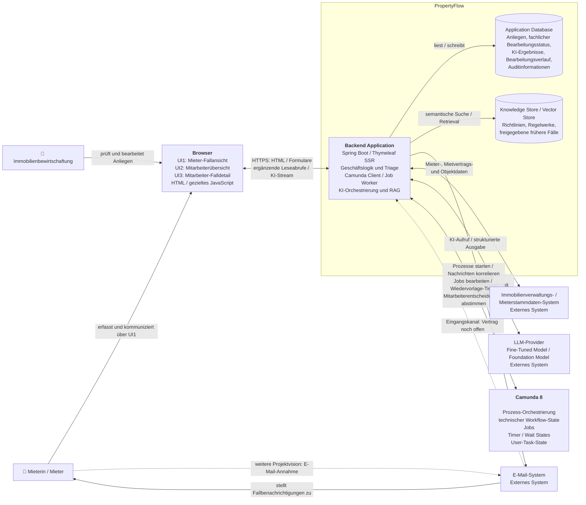

# C4 Level 2 – Container View

Die geplante Architektur folgt ADR-001 bis ADR-004: Der modulare
Spring-Boot-Monolith rendert UI1 bis UI3 mit Thymeleaf. Im Browser ergänzt
gezieltes JavaScript die periodische Aktualisierung und die KI-Formulierung
mit Streaming in UI3. Die Darstellung ist kein Implementierungsnachweis.

PropertyFlow hält Nachrichten, Memos, fachlichen Status, wirksame Dringlichkeit,
Wiedervorlagetermin und Auditdaten. Camunda führt den technischen Prozess und
verarbeitet neue Mieternachrichten auch während einer Wiedervorlage.
Browserzugriffe laufen über PropertyFlow; alle drei Ansichten lesen gespeicherte
Ergebnisse, und nur UI3 bietet den interaktiven Formulierungs-Stream.

Die fachlichen Regeln und noch offenen technischen Verträge stehen in
[Fallverwaltung](../specifications/fallverwaltung.md),
[Fallkommunikation](../specifications/fallkommunikation.md),
[Benachrichtigungen](../specifications/benachrichtigungen-und-zustellung.md) und
[Fallzugriff](../specifications/fallzugriff-und-sicherheit.md).
Für Mitarbeitende gibt es keine Anmeldung in PropertyFlow; die technische
Absicherung des Mitarbeiterbereichs und die individuelle Zuordnung von
Änderungen sind unter ZUG-04 noch zu konkretisieren.
