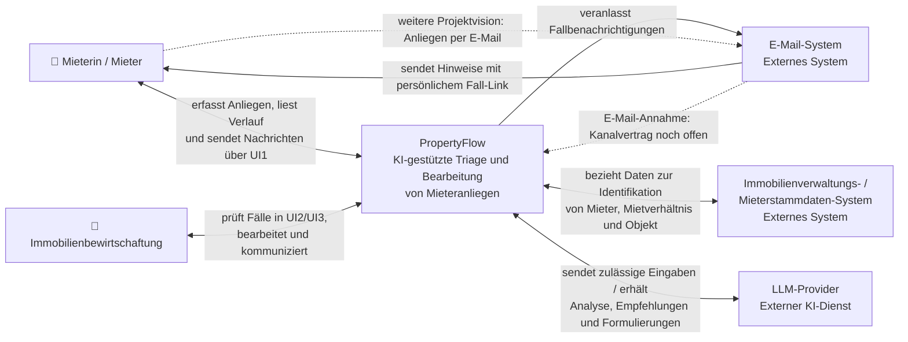

# C4 Level 1 – System Context

PropertyFlow unterstützt Immobilienbewirtschaftungen bei der
KI-gestützten Triage und Bearbeitung von Mieteranliegen.

Die Darstellung beschreibt den geplanten Systemkontext. Der vereinbarte
UI-Umfang umfasst Web-Erfassung und Fallkommunikation über UI1 sowie
Mitarbeiterübersicht und Fallbearbeitung über UI2/UI3. Benachrichtigungen
werden per E-Mail mit dem persönlichen Fall-Link zugestellt.

Analyse und Dringlichkeitsbewertung erfolgen automatisch im Camunda-Prozess;
die interaktive KI-Funktion unterstützt die bewusste Formulierung einer externen
Mitarbeiternachricht. Für diesen Kommunikationskontext gilt
[KOM-02](../specifications/fallkommunikation.md#kom-02-llm-kommunikation-ohne-interne-memos).
Die weitergehende E-Mail-Annahme aus der Vision benötigt gemäss
[UC-001](../use_cases/UC-001-mieteranliegen-einreichen.md) einen eigenen Kanalvertrag.
Externe Beauftragungen werden durch die Verwaltung ausserhalb von PropertyFlow
organisiert; eine automatische Beauftragungsschnittstelle gehört nicht zum Umfang.
