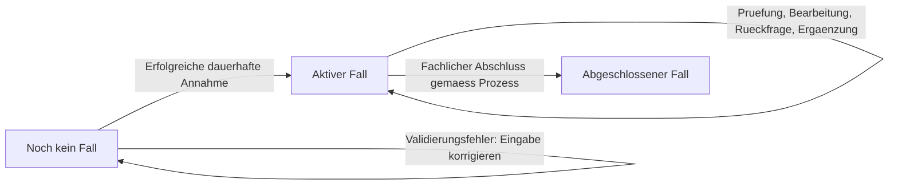

# Fallverwaltung – Fallanlage und Lebenszyklus

**Status:** Zentrale Spezifikation der vereinbarten fachlichen Regeln und Bearbeitungsstatus; Prozessübergänge und technische Verträge noch zu konkretisieren.

**Stand:** 10.10.2026

**Geltungsbereich:** Erfassung, Backoffice, fachliche Services, Persistenz und Camunda-Integration von PropertyFlow.

## Zweck und Abgrenzung

Dieses Dokument definiert, wann ein Fall entsteht, wie er identifiziert und fortgeführt wird und was sein fachlicher Abschluss bedeutet. Es ist die gemeinsame Quelle für diese Regeln. Screen-Spezifikationen beschreiben ihre Darstellung; Use-Cases beschreiben die Nutzung aus Sicht der jeweiligen Akteure.

Die Anforderungen werden aus [Vision](../vision.md), [Projekt-Kontext](../project-context.md), [ADR-001](../architecture/adr/ADR-001-grundarchitektur.md), [ADR-002](../architecture/adr/ADR-002-camunda8-workflow-orchestrierung.md), den bestehenden Use-Cases und der bisherigen [Screen-01-Spezifikation](../frontend/ansicht-01-mieter-fallansicht.md) zusammengeführt. Akzeptierte Architekturentscheidungen bleiben gültig. Neue Konkretisierungen sind ausdrücklich als Review-Vorschlag gekennzeichnet.

| Zentrale Quelle | Verantwortung |
|---|---|
| Dieses Dokument | Fallidentität, Annahme, Ursprungsdaten, Zuordnung, fachlicher Lebenszyklus und Beziehung zum Workflow |
| [Fallkommunikation](fallkommunikation.md) | Interne/externe Nachrichten, Veröffentlichung, Ausschluss interner Memos aus LLM-Kommunikation und Nachrichtensperre nach Abschluss |
| [Dringlichkeitsbewertung](dringlichkeitsbewertung.md) | Stufen, Farben, Erst-/Neubewertung, Vorrang manueller Einstufungen und mieteröffentliche Änderungshistorie |
| [Fallzugriff und Sicherheit](fallzugriff-und-sicherheit.md) | Direkter persönlicher Tokenzugriff, Berechtigungen, Widerruf und Ersatz |
| [Benachrichtigungen und Zustellung](benachrichtigungen-und-zustellung.md) | E-Mail-Auslöser, Versandpflicht, Wiederholungen und Zustellfehler |
| [Screen 01](../frontend/ansicht-01-mieter-fallansicht.md) | Felddarstellung, Navigation, Routenübersicht, Rückmeldungen und Wireframes |
| [Screen 02](../frontend/ansicht-02-mitarbeiter-falluebersicht.md) | Mitarbeiterliste, Suche, Filter, Sortierung, Seitennavigation und Aktualisierung |
| [Architektur und Modulgrenzen](../architecture/module-structure.md) | Technische Zuständigkeiten und öffentliche Integrationsverträge |

Die konkrete zuverlässige Übergabe an Camunda und Mail, ein mögliches Outbox-Verfahren und konkrete Datenbankschemata werden separat entschieden. Dieses Dokument legt die erforderlichen fachlichen Ergebnisse fest und bestätigt keine bereits vorhandene Umsetzung.

## FALL-01: Fallidentität und Erfassungskanal

Ein Fall ist das dauerhaft angenommene Mieteranliegen mit seiner fachlichen Identität und dem zugehörigen Bearbeitungsverlauf. Das Öffnen eines Formulars und noch nicht übermittelte Eingaben erzeugen keinen Fall. Eine dauerhafte Entwurfsverwaltung ist im aktuellen Umfang nicht vorgesehen. Dies gilt auch für externe Antworten im Mitarbeiterdetail: Kein Entwurfsspeichern; externe Nachrichten werden erst bei Veröffentlichung persistiert gemäss KOM-01. Interne Memos werden separat bewusst intern gespeichert.

Die Case-ID wird serverseitig vergeben, ist eindeutig und bleibt über den Lebenszyklus unverändert. Ein Beispiel wie `REQ-2026-001` legt noch kein verbindliches Nummernformat fest. Die Case-ID ist weder ein Zugriffstoken noch die technische Camunda-Prozessinstanz-ID. Der persönliche Mieterlink enthält ausschliesslich einen geheimen Token; seine serverseitige Fallzuordnung und die unveränderte Case-ID bei Tokenersatz regelt [ZUG-01](fallzugriff-und-sicherheit.md#zug-01-case-id-und-geheimer-token).

Die [Vision](../vision.md) sieht Webformular und E-Mail als Eingangskanäle vor. Für jeden Kanal gelten dieselben Regeln zur dauerhaften Annahme und Fallidentität. Die Feldbelegung und sichere Zuordnung eingehender E-Mails sind separat zu spezifizieren. Eine E-Mail ist nicht automatisch ein neuer Fall; eine sicher zugeordnete Ergänzung gehört zum bestehenden Fall gemäss [KOM-03](fallkommunikation.md#kom-03-asynchrone-fallkommunikation).

Die Aktion «Neues Anliegen melden» eröffnet die Erfassung. Erst eine neue erfolgreich angenommene Einreichung erzeugt eine neue Case-ID. Das Ergänzen eines bestehenden Falls erzeugt keine neue Case-ID und keinen zweiten führenden Bearbeitungsprozess.

## FALL-02: Erfolgreiche Annahme

**Ein Fall gilt erst nach erfolgreicher dauerhafter Speicherung als angenommen.** Weder eine Browserbestätigung noch ein gestarteter LLM-Aufruf ersetzt diesen Zeitpunkt.

Für die Web-Erfassung sind Betreff, Beschreibung, Objekt-/Wohnungsreferenz und E-Mail-Adresse vorgesehen. Konkrete Feldlängen bleiben Review-Vorschläge der [Screen-Spezifikation](../frontend/ansicht-01-mieter-fallansicht.md#31-eingabefelder); deren Darstellung und Fehlertexte bleiben dort. Der Server prüft die geltenden Eingaberegeln unabhängig vom Browser.

Die Annahme umfasst fachlich:

1. Eingabe und zulässige Einreichung prüfen.
2. Case-ID vergeben und Ursprungsdaten dauerhaft speichern.
3. Die ursprüngliche Beschreibung als erste externe Mitteilung eindeutig in die Historie aufnehmen oder darauf referenzieren; keine fachlich doppelte Nachricht anlegen.
4. Den initialen fachlichen Stand als eingegangen und aktiv festhalten.
5. Die nachgelagerte Prozessübergabe und erforderliche Bestätigungsbenachrichtigung zuverlässig veranlassen.
6. Erst nach bestätigter Speicherung den Erfolg mit der Case-ID zurückmelden.

Die für eine angenommene Meldung erforderlichen Daten und Folgeaufträge müssen nach einem Neustart rekonstruierbar sein. Ihre technische Transaktionsgrenze wird im Integrationsdesign festgelegt; eine gemeinsame lokale Transaktion mit Camunda oder dem Maildienst wird nicht vorausgesetzt.

Die Erfassung wartet nicht auf KI/RAG, erfolgreiche E-Mail-Zustellung, einen erreichbaren Camunda-Server oder eine menschliche Entscheidung. Ein bereits gespeicherter Fall bleibt bei einem Ausfall dieser Komponenten erhalten und für die manuelle Bearbeitung zugänglich.

## FALL-03: Wiederholung und doppelte Einreichung

Die technische Wiederholung derselben Einreichung darf keinen zweiten Fall erzeugen. Der bereits beschriebene Absende-ID-Vertrag bleibt Grundlage: gleiche Einreichung und gleiche serverseitig geprüfte Absende-ID liefern dasselbe Ergebnis und dieselbe Case-ID zurück; abweichender Inhalt mit derselben Absende-ID wird als Konflikt behandelt. Der technische Vertrag und seine Aufbewahrungsdauer sind noch festzulegen.

Bei unklarem Request-Ausgang, etwa nach einem Netzwerkabbruch, kann die Speicherung bereits erfolgt sein. Eine Wiederholung darf deshalb keine neue fachliche Identität erzeugen. Auch Prozessstart-Wiederholungen müssen demselben Fall zugeordnet und gegen Mehrfachwirkung abgesichert werden.

Das ist von zwei bewusst getrennten Einreichungen mit ähnlichem Inhalt zu unterscheiden: Eine automatische fachliche Zusammenführung solcher Fälle ist nicht beschlossen. Ähnliche Texte allein rechtfertigen weder Zusammenführen noch Verwerfen eines Anliegens.

## FALL-04: Ursprungsdaten und Zuordnung

Die bei der Annahme gespeicherten Ursprungsangaben sind für den Mieter unveränderlich. Er ergänzt oder korrigiert seine Meldung über eine neue Nachricht. Die Ursprungseingabe und frühere Nachrichten werden dadurch nicht überschrieben.

Die eingegebene Objekt-/Wohnungsreferenz ist von einer später bestätigten Zuordnung zu Mieterstammdaten zu unterscheiden. Eine unklare Zuordnung verhindert die Annahme nicht. Sie bleibt intern als offen erkennbar und kann durch die dafür zuständige Fachbearbeitung geklärt werden. Dabei dürfen keine fremden Stammdaten in der öffentlichen Erfassung offengelegt werden.

Eine syntaktisch gültige E-Mail und eine angegebene Adresse bestätigen weder die persönliche Identität noch das Mietverhältnis. Identitätsprüfung, Empfängerwechsel und Zugriffsberechtigungen werden in [Fallzugriff und Sicherheit](fallzugriff-und-sicherheit.md) geführt. Der persönliche Fall-Link hat keine zeitliche Ablauffrist. Ein bewusster Widerruf oder Ersatz des Links verändert den fachlichen Fallstatus nicht.

**Bestätigt am 10.10.2026 – Zuordnung durch Mitarbeiter:** Rechts bei Objekt/Wohnung in UI3 steht für die Bearbeitung aktiver Fälle «Zuordnung ändern» zur Verfügung. Der Mitarbeiter wählt das Objekt und die zugehörige Wohnung aus und bestätigt mit «Speichern». Damit kann er eine offene Zuordnung klären oder eine bestehende Zuordnung korrigieren. Die Auswahl allein verändert keine gespeicherten Daten. Ein zusätzlicher Freitext ersetzt die bestätigte Auswahl nicht; die ursprüngliche Mieterangabe bleibt unverändert nachvollziehbar.

PropertyFlow prüft die Berechtigung und die gültige Zusammengehörigkeit von Objekt und Wohnung serverseitig. Die bestätigte Zuordnung wird getrennt von den Ursprungsangaben mit vorherigem und neuem Wert, Zeitpunkt und handelndem Mitarbeiter gespeichert. UI3 zeigt den gespeicherten Stand; UI2 übernimmt ihn in die bestehende Spalte «Objekt/Wohnung». Eine erfolglose Speicherung wird nicht als erfolgreiche Zuordnung dargestellt. Die Konfliktprüfung aus FALL-06 gilt auch für die Zuordnungsänderung; eine zwischenzeitliche Änderung darf nicht unbemerkt überschrieben werden. Nachrichteneingabe und laufende KI-Formulierung bleiben erhalten.

Die Zuordnung klärt den entsprechenden Hinweis «Zuordnung offen»; weitere Prüfgründe bleiben bestehen. Ein gewünschter manueller Statuswechsel erfolgt weiterhin über die separate Statusaktion nach FALL-06. Die Änderung bestätigt keine persönliche Identität und ändert weder Kontaktadresse noch Empfänger oder Mieterzugang; hierfür gelten die eigenständigen Regeln aus [Fallzugriff und Sicherheit](fallzugriff-und-sicherheit.md). Die Aktion ordnet den Fall vorhandenen Stammdaten zu und führt keine Stammdatenpflege ein. Auswahlgestaltung, Datenzugriff und technische Speicherung werden im Service-/UI-Vertrag konkretisiert.

## FALL-05: Fachlicher Lebenszyklus

Der gemeinsame Grundzustand unterscheidet **noch keinen Fall**, **aktiven Fall** und **abgeschlossenen Fall**. «Neuer Fall» bezeichnet im UI das Erfassungsformular und ist kein bereits persistierter Fallstatus.

| Phase | Eintritt | Bedeutung und zulässige Fortsetzung |
|---|---|---|
| Noch kein Fall | Formular geöffnet oder Annahme gescheitert | Eingaben können korrigiert und eingereicht werden. Kein bearbeitbarer Fall wurde bestätigt. |
| Aktiv | Annahme nach FALL-02 erfolgreich | Der Fall existiert, auch wenn der Prozessstart noch aussteht. Zuordnung, Prüfung, Bearbeitung und Kommunikation erfolgen unter den jeweiligen Berechtigungen. |
| Abgeschlossen | Fachlich vorgesehener Abschluss nach FALL-07 konsistent übernommen | Berechtigtes Lesen bleibt möglich; die Nachrichtensperre aus KOM-04 gilt. Eine neue Meldung ist ein separater Fall. |

Das Diagramm zeigt den fachlichen Grundvertrag. Es ersetzt weder BPMN noch schreibt es eine zweite Workflow-Engine in PropertyFlow vor.

### Fachliche Bearbeitungsstatus – vereinbart

**Vereinbart am 09.10.2026, ergänzt am 10.10.2026:** Die folgenden acht Bezeichnungen und Bedeutungen bilden die fachlichen Bearbeitungsstatus. «Wartet auf Wiedervorlage» wurde mit FALL-11 ergänzt. Technische Enum-Werte, weitere Übergangsbedingungen und das Mapping zum BPMN-Modell werden separat festgelegt.

| Bearbeitungsstatus | Bedeutung |
|---|---|
| Eingegangen | Dauerhaft angenommen; weitere Bearbeitung kann noch ausstehen. |
| In Abklärung | Automatische Analyse oder fachliche Abklärung läuft. |
| Wartet auf Mieterantwort | Eine Rückfrage wurde veröffentlicht; benötigte Informationen fehlen noch. |
| Mitarbeiterprüfung erforderlich | Menschliche Prüfung ist nötig, etwa nach einem Analysefehler, bei verbleibender Unklarheit oder wegen einer verpflichtenden menschlichen Entscheidung nach FALL-10. |
| In Bearbeitung | Das weitere Vorgehen wurde festgelegt; die Umsetzung läuft. |
| Wartet auf externe Rückmeldung | Informationen oder eine Rückmeldung beispielsweise von Hauswart oder Fachstelle stehen aus. |
| Wartet auf Wiedervorlage | Ein Mitarbeiter hat die erneute Prüfung terminiert. Camunda wartet bis zum wirksamen Termin; neue Mieternachrichten werden parallel verarbeitet und können die Wiedervorlage vorziehen. |
| Abgeschlossen | Der fachliche Abschluss wurde bestätigt; neue Nachrichten sind gemäss KOM-04 gesperrt. |

**Vereinbarte Konkretisierung am 09.10.2026:** Bei einem aktiven Fall führen **offene Objektzuordnung**, **fehlgeschlagene KI-Analyse** und **klärungsbedürftiger E-Mail-Versand** einheitlich zum Bearbeitungsstatus **«Mitarbeiterprüfung erforderlich»**. Der jeweilige Grund bleibt zusätzlich intern am Fall gespeichert und für die Bearbeitung nachvollziehbar: «Zuordnung offen», «KI-Analyse fehlgeschlagen» bzw. «E-Mail-Versand klären». Screen 02 zeigt den Bearbeitungsstatus, aber keine Problemhinweise. Die konkrete interne Darstellung der Gründe wird bei Screen 03 festgelegt. Mehrere Gründe können gleichzeitig vorliegen. Ein automatischer Wiederholungsversuch hebt diese Zuordnung nicht auf. Diese Vereinbarung ersetzt die frühere Ausnahme für Analysefehler während automatischer Wiederholungen. Der Übergang wird im vorgesehenen Camunda-/PropertyFlow-Ablauf vorgenommen, nicht allein aus einem Browserfehler abgeleitet.

Die Zuordnung zu «Mitarbeiterprüfung erforderlich» beschreibt den Eintritt in die erforderliche Prüfung. Wechselt ein Mitarbeiter nach Prüfung bewusst direkt auf «In Bearbeitung», gilt dies gemäss FALL-06 auch ohne Wiedervorlage als Mitarbeiterentscheidung. Entscheidet er über eine Wiedervorlage oder deren Löschung, gelten die bestätigten Statusübergänge aus FALL-11. Bereits berücksichtigte Gründe erzwingen nach diesen Entscheidungen ohne neue Erkenntnisse keinen sofortigen Rückwechsel; sie bleiben intern nachvollziehbar und gelten dadurch nicht pauschal als fachlich erledigt.

Eine veröffentlichte Rückfrage mit ausstehender Mieterantwort ist fachliches Warten und für sich kein technischer Fehler. Nach Behebung der Hinweise muss die fachlich passende Fortsetzung im Prozess erfolgen; der konkrete Übergang bleibt festzulegen. Ein noch ausstehender Analyse- oder Versandversuch ohne festgestellten Fehler ist nicht automatisch ein Problemhinweis.

**Abschlussgrenze:** Ein Versandproblem, das erst nach fachlichem Abschluss festgestellt wird, bleibt als Hinweis am Fall für die interne Bearbeitung nachvollziehbar; es wird nicht in Screen 02 angezeigt. Der Fall bleibt «Abgeschlossen»; die Problembehandlung eröffnet ihn nicht wieder und umgeht die Nachrichtensperre nicht. Der aktive Status «Mitarbeiterprüfung erforderlich» wird nicht zur stillschweigenden Wiedereröffnung verwendet.

Die ersten sieben Bearbeitungsstatus gehören zur aktiven Phase; «Abgeschlossen» gehört zur abgeschlossenen Phase. Eine zusätzliche Nachricht ist während eines aktiven Falls zulässig, auch wenn der Workflow gerade nicht auf eine Mieterantwort wartet. Jede gespeicherte Mieter-Nachricht veranlasst die Neubewertung gemäss DRING-05. Welche fachliche Fortsetzung sie auslöst, bestimmt der modellierte Prozess. Der blosse Eingang einer Nachricht beantwortet nicht automatisch jede offene fachliche Rückfrage.

Die Zuordnung ist keine feste lineare Reihenfolge. Der Workflow kann Abklärungen und Rückfragen wiederholen. Solche Schleifen behalten die Case-ID bei und öffnen keine neue Fallanlage.

**Bestätigt am 10.10.2026 – Mitarbeiter-Rückfragen:** Beim Veröffentlichen einer externen Nachricht mit ausdrücklich gesetztem Mieterantwortbedarf wird der Fall im vorgesehenen PropertyFlow-/Camunda-Ablauf auf «Wartet auf Mieterantwort» gesetzt, sofern kein offener Prüfbedarf nach FALL-05/FALL-10 den Status «Mitarbeiterprüfung erforderlich» verlangt. In diesem Fall bleibt die Rückfrage trotzdem als offen nachvollziehbar. Der Wartestatus wird nicht allein durch die Auswahl im Browser oder die KI-Formulierung gesetzt.

Eine reine Informationsnachricht setzt keinen neuen Mieter-Wartestatus, entfernt keinen bestehenden Antwortbedarf und löst für sich keinen beliebigen Statuswechsel aus. **Bestätigt am 10.10.2026:** Camunda veranlasst die inhaltliche Prüfung neuer Mieternachrichten gegen jede offene Rückfrage. Eindeutig beantwortete Fragen werden einzeln erledigt; unvollständige, unklare oder themenfremde Antworten lassen die betroffenen Fragen offen. Die Regeln und Prüfkriterien sind zentral in [KOM-03](fallkommunikation.md#inhaltliche-prüfung-offener-rückfragen) geführt. Beim erfolgreichen Fallabschluss endet noch offener Antwortbedarf gemäss KOM-04. Wird eine Rückfrage während eines aktiven Falls gegenstandslos, kann ein Mitarbeiter ihren Antwortbedarf über «Antwortbedarf aufheben» gemäss KOM-03 gezielt beenden.

### Status nach Beantwortung aller Rückfragen

**Bestätigt am 10.10.2026:** Ergibt die inhaltliche Prüfung, dass alle zuvor offenen Rückfragen beantwortet sind, verarbeitet Camunda die Antworten im vorgesehenen Fallprozess weiter. Erfolgt dabei kein zulässiger automatischer Abschluss nach FALL-07/FALL-10 und läuft keine Wiedervorlage, erhält der weiterhin aktive Fall nach der automatischen Verarbeitung den Status «Mitarbeiterprüfung erforderlich». Der Mitarbeiter entscheidet anschliessend über das weitere Vorgehen.

Eine laufende Wiedervorlage bleibt bestehen; neue Erkenntnisse können sie nach FALL-11 vorziehen oder eine sofortige Mitarbeiterprüfung auslösen. Ein erfolgreich abgeschlossener Fall bleibt «Abgeschlossen». Sind noch Rückfragen offen oder wurden sie nicht zuverlässig als beantwortet erkannt, greift der Übergang wegen vollständiger Beantwortung nicht; andere Prüfgründe und Statusregeln bleiben wirksam. Eine reine Informationsnachricht ohne zuvor offene Rückfragen löst diesen Übergang ebenfalls nicht aus.

Die Statusübernahme wird mit dem aktuellen Fallstand und Camunda abgestimmt. Eine wiederholte Verarbeitung derselben bereits berücksichtigten Antworten darf eine anschliessende bewusste Mitarbeiterentscheidung nach FALL-06/FALL-11 nicht zurücknehmen. Die Nachweise für inhaltliche Prüfung und diese Statusfortsetzung werden gemeinsam in KOM-AK-09 geführt.

### Status nach manuellem Aufheben des Antwortbedarfs

**Bestätigt am 10.10.2026:** Hebt ein Mitarbeiter den letzten offenen Mieterantwortbedarf über die UI3-Aktion «Antwortbedarf aufheben» auf, wechselt der aktive Fall auf «In Bearbeitung», sofern keine laufende Wiedervorlage und kein vorrangiger aktueller Mitarbeiterprüfbedarf bestehen. Eine laufende Wiedervorlage bleibt gemäss FALL-11 wirksam; vorrangiger Mitarbeiterprüfbedarf behält «Mitarbeiterprüfung erforderlich». Bereits durch eine bewusste Mitarbeiterentscheidung berücksichtigte Prüfgründe werden dabei nach FALL-06/FALL-11 nicht erneut als neuer Prüfbedarf behandelt.

Besteht nach der Aufhebung weiterer Mieterantwortbedarf, löst die Aktion allein keinen Statuswechsel aus. Die Aufhebung schliesst den Fall nicht ab, bestätigt keine Behebung des Problems und gibt keine weiteren Massnahmen frei. Fallabschluss und Beantwortung durch den Mieter bleiben eigene Vorgänge. PropertyFlow prüft und speichert Antwortbedarf und einen daraus folgenden Statuswechsel konsistent auf dem aktuellen Fallstand und stimmt die Änderung mit Camunda ab. Es entsteht kein zusätzlicher Status. Die Kommunikationsregeln und Prüfkriterien stehen in KOM-03/KOM-AK-10.

## FALL-06: Fachlicher Status und technischer Workflow

| Information | Führende Verantwortung | Abgrenzung |
|---|---|---|
| Case-ID, Ursprungsdaten, Objektzuordnung, fachlicher Status und Verlauf | PropertyFlow | Grundlage der fachlichen Fallansichten |
| Prozessinstanz, Prozessposition, aktive Aufgaben, Timer, Jobs und Incidents | Camunda 8 | Technischer Workflow-State gemäss ADR-002 |
| E-Mail-Auftrag und Versand-/Zustellinformation | PropertyFlow und Mailintegration | Benachrichtigungszustand; kein Fallstatus |
| Analyseergebnis oder technischer Analysefehler | Zuständiger PropertyFlow-Service | Unterstützende Information; keine eigenständige fachliche Abschlussentscheidung |

Für einen angenommenen Fall wird genau ein führender Camunda-Bearbeitungsprozess zuverlässig gestartet und dem Fall zugeordnet. Unmittelbar nach Annahme kann dieser Start noch ausstehen. Ein technischer Retry darf keine zweite unabhängige Bearbeitung desselben Falls eröffnen. Eine mögliche interne BPMN-Zerlegung wird dadurch nicht vorweggenommen.

Fachliche Statusänderungen erfolgen durch autorisierte PropertyFlow-Anwendungsdienste im vorgesehenen Prozessablauf. **Bestätigt am 10.10.2026:** Mitarbeitende können den Bearbeitungsstatus in UI3 manuell anpassen. Der Browser übermittelt die gewählte Änderung zur serverseitigen Autorisierung und fachlichen Prüfung; er kann Statuswerte nicht ungeprüft verbindlich vorgeben. Die bestätigte Änderung wird in PropertyFlow mit Zeitpunkt und handelnder Mitarbeiteridentität nachvollziehbar gespeichert und mit dem führenden Camunda-Prozess abgestimmt. Die Abschluss-, Wiedereröffnungs- und menschlichen Entscheidungsregeln bleiben gültig. **Bedienung in UI3 bestätigt am 10.10.2026:** Rechts «Status ändern», Status auswählen und bewusste Übernahme mit «Speichern». Die Auswahl allein bewirkt keine Änderung. **Konfliktverhalten in UI3 bestätigt am 10.10.2026:** Vor dem Speichern wird serverseitig geprüft, ob sich die Einstellungen seit Beginn der Bearbeitung geändert haben. Bei Konflikt wird nicht gespeichert; der aktuelle Einstellungsstand wird neu geladen und «konnte nicht erfolgreich gespeichert werden» angezeigt. Mitarbeitereingabe und laufende KI-Formulierung bleiben erhalten. Prüfung und Speicherung werden gegen gleichzeitige Änderungen abgesichert; der technische Vertrag bleibt zu konkretisieren. **Bestätigt am 10.10.2026:** Abschluss und Wiedereröffnung werden über die separaten UI3-Buttons «Fall abschliessen» beziehungsweise «Fall wiedereröffnen» ausgelöst; die normale Statusauswahl dient aktiven Bearbeitungsstatus. Die Bestätigungsabläufe und der Zielstatus nach Wiedereröffnung sind unter FALL-07 vereinbart; weitere zulässige Übergänge zwischen aktiven Bearbeitungsstatus bleiben zu konkretisieren. PropertyFlow speichert den fachlichen Status als fachliche Sicht auf den Ablauf; es führt daneben keinen konkurrierenden Workflow ein.

Technische Incidents und Wiederholungen schliessen den Fall nicht. Für offene Objektzuordnung, fehlgeschlagene KI-Analyse und klärungsbedürftigen E-Mail-Versand gilt bei aktiven Fällen die vereinbarte Übernahme von «Mitarbeiterprüfung erforderlich» gemäss FALL-05. Dieser fachliche Statuswechsel wird in PropertyFlow gespeichert; eine reine technische Fehlermeldung im Browser ersetzt ihn nicht. Die Ansichten lesen den zuletzt bestätigten fachlichen Status. Die Verwaltung muss den Fall trotz ausgefallener Automatisierung manuell weiterbearbeiten können; die technische Synchronisierung ist im Integrationsvertrag abzusichern.

Ein technischer Abbruch oder ein beliebiges BPMN-Endereignis ist nicht ohne fachliche Zuordnung mit einem erfolgreichen Fallabschluss gleichzusetzen. Massgeblich ist der im Fachprozess ausdrücklich vorgesehene Abschluss.

### Direkter Übergang in die Bearbeitung

**Bestätigt am 10.10.2026:** Nach Prüfung des aktuellen Fallstands kann der Mitarbeiter über «Status ändern» → «In Bearbeitung» → «Speichern» direkt die weitere Bearbeitung übernehmen, auch ohne Wiedervorlage. Der bestätigte Wechsel von «Mitarbeiterprüfung erforderlich» zu «In Bearbeitung» gilt selbst als bewusste Mitarbeiterentscheidung; eine zusätzliche Aktion «Prüfung erledigt» ist nicht erforderlich. Das Speichern eines Memos allein hat diese Wirkung weiterhin nicht.

Die Entscheidung wird mit Mitarbeiteridentität, Zeitpunkt und Bezug zum geprüften Fallstand einschliesslich der bereits berücksichtigten Prüfgründe nachvollziehbar gespeichert und mit Camunda abgestimmt. Dieselben Gründe oder wiederholte Auswertungen derselben Erkenntnisse setzen den Fall nicht sofort wieder auf «Mitarbeiterprüfung erforderlich». Neue Erkenntnisse oder neu entstandene Prüfgründe können erneut eine Prüfung auslösen. Die bestehende Konfliktprüfung verhindert, dass eine Entscheidung auf veraltetem Einstellungsstand eine zwischenzeitliche Änderung überschreibt.

Die Entscheidung bestätigt die Übernahme der weiteren Bearbeitung. Bestehende Hinweise und ihre Historie bleiben nachvollziehbar; technische Probleme gelten dadurch nicht als behoben. Die konkrete Bearbeitungsentscheidung ist keine pauschale Freigabe weiterer Kosten, Folgehandlungen oder eines späteren Systemabschlusses nach FALL-10 und erledigt keine offene Mieterfrage. Die serverseitige Autorisierung sowie die Regeln zu Abschluss und Wiedereröffnung bleiben wirksam.

## FALL-07: Abschluss und Zeit danach

Ein Fall wechselt erst nach dem fachlich vorgesehenen Abschluss im Camunda-Ablauf und der konsistenten Übernahme in PropertyFlow in die abgeschlossene Phase. Eine abgeschlossene KI-Analyse, ein Browserabbruch oder eine verschickte E-Mail genügt dafür nicht.

**Vereinbart am 09.10.2026:** Ein Fall kann durch einen Mitarbeiter oder durch das System abgeschlossen werden. «Fachlich erledigt» bedeutet, dass für die Verwaltung kein weiterer Bearbeitungsbedarf besteht. Dies kann eine behobene Störung oder ein eindeutig der Eigenverantwortung des Mieters zugeordnetes Anliegen sein; ein Abschluss behauptet deshalb nicht in jedem Fall eine ausgeführte Reparatur.

| Abschluss durch | Fachliche Voraussetzung / Beispiel |
|---|---|
| **Mitarbeiter** | Ein Mitarbeiter mit der einheitlichen Adminrolle bestätigt den fachlichen Abschluss. Er beurteilt, dass keine weitere Bearbeitung des Falls erforderlich ist. |
| **System – Behebung bestätigt** | Eine gespeicherte Mieter-Nachricht bestätigt eindeutig, dass das Problem behoben ist und keine weitere Hilfe benötigt wird, z. B. «Fehler behoben, keine weitere Hilfe nötig». Das System prüft diese Aussage im Zusammenhang des aktuellen Falls. |
| **System – kein Bearbeitungsbedarf der Verwaltung** | Die fachliche Prüfung ergibt eindeutig, dass das Anliegen gemäss den hinterlegten Fachregeln vom Mieter selbst zu erledigen ist. Beispiel: ein Glühbirnenwechsel, soweit der konkrete Austausch nach diesen Regeln in die Eigenverantwortung des Mieters fällt. |

Für die beiden beschriebenen Systemabschlüsse ist keine zusätzliche Einzelfreigabe durch einen Mitarbeiter vorgesehen, sofern keine bestehende verpflichtende menschliche Prüfung greift. Das System führt den Abschluss im vorgesehenen Camunda-/PropertyFlow-Ablauf aus. Die Einordnung wird vor der Übernahme serverseitig validiert; ein isoliertes Stichwort wie «behoben» oder «Glühbirne» genügt nicht. Die fachliche Regel und der aktuelle Fallinhalt sind massgeblich. Bei unklarer oder widersprüchlicher Einordnung wird nicht automatisch abgeschlossen; nötige menschliche Prüfung wird als «Mitarbeiterprüfung erforderlich» geführt.

Die Beispiele sind bestätigte Abschlussgründe, kein abschliessender Katalog aller künftig möglichen Automatisierungsregeln. Weitere automatische Gründe sind gesondert fachlich festzulegen. Die Einstufung «kein konkreter Fall» bezeichnet hier fehlenden weiteren Bearbeitungsbedarf der Verwaltung: Ein bereits angenommenes Anliegen behält Case-ID, Ursprungsdaten und Historie und erhält den Status «Abgeschlossen». Es wird weder verworfen noch gelöscht.

Die verpflichtenden menschlichen Entscheidungen sind in [FALL-10](#fall-10-automatisierung-und-menschliche-freigabe) konkretisiert: Kosten bzw. verbindliche externe Beauftragung, sehr dringliche oder schwerwiegende Fälle sowie starke oder eskalierte Mieterbeschwerden. Sie entsprechen den Prüfgrenzen aus [ADR-002](../architecture/adr/ADR-002-camunda8-workflow-orchestrierung.md) und der [Sicherheitsbasis](../evaluation/evaluationsgrundlage.md). Ein offener menschlicher Entscheidungsbedarf darf nicht durch einen Systemabschluss umgangen werden. Ein Analysefehler, eine offene Zuordnung oder ein Versandproblem ist für sich kein Abschlussgrund. Die Dringlichkeitsstufe allein begründet ebenfalls keinen Abschluss.

Der Abschluss bleibt mit Zeitpunkt, Abschlussquelle (Mitarbeiter oder System), fachlichem Grund und auslösender Grundlage nachvollziehbar. Bei Mitarbeitern wird die handelnde Identität, beim System die relevante Nachricht bzw. Fachregel und Prozessreferenz intern zugeordnet. Ein durch die Mieternachricht ausgelöster Abschluss hat die Quelle «System»; der Mieter erhält dadurch keine direkte Berechtigung zur Statusänderung. Eine wiederholte Verarbeitung desselben Abschlusses erzeugt keinen zweiten fachlichen Abschluss oder zusätzlichen logischen Abschlussmailauftrag.

**Bestätigt am 10.10.2026 – Abschlussvermerk bei Mitarbeiterabschluss:** Beim erfolgreichen Mitarbeiterabschluss speichert PropertyFlow intern den festen Vermerk «Vom Mitarbeiter geprüft: keine weitere Bearbeitung erforderlich.» zusammen mit dem handelnden Mitarbeiter, dem Zeitpunkt und der Abschlussquelle «Mitarbeiter». Die bewusste Abschlussbestätigung ist die auslösende Grundlage. Damit ist der fachliche Grund auch ohne separates Memo nachvollziehbar. Der Vermerk gehört zum strukturierten Abschlussnachweis; er ist keine zusätzliche Nachricht oder Memo-Speicherung und wird nicht als Nachricht an den Mieter veröffentlicht. Ein zusätzliches Begründungsfeld entfällt. Eine ausführlichere Erklärung kann der Mitarbeiter weiterhin freiwillig vor dem Abschluss als internes Memo speichern.

Bei einem automatischen Abschluss wird weiterhin der tatsächlich geprüfte Systemgrund einschliesslich seiner Grundlage gespeichert, beispielsweise die eindeutige Behebungsbestätigung des Mieters oder die einschlägige Fachregel. Der feste Mitarbeitervermerk ersetzt diesen Nachweis nicht. Ein abgebrochener oder fehlgeschlagener Abschluss erzeugt keinen erfolgreichen Abschlussnachweis; die geltenden Abschlussvoraussetzungen und Freigabegrenzen bleiben wirksam.

Die Folgen für interne und externe Nachrichten sind zentral in [KOM-04](fallkommunikation.md#kom-04-nachrichtensperre-nach-fallabschluss) festgelegt: Nach Abschluss dürfen keine neuen Nachrichten mehr entstehen. **Bestätigt am 10.10.2026:** Mit dem erfolgreichen Abschluss endet auch noch offener Mieterantwortbedarf. Bisherige Rückfragen bleiben im Verlauf erhalten, ohne unbeantwortete Fragen als beantwortet auszugeben. Dies ist eine Folge des Status «Abgeschlossen» und führt keinen zusätzlichen Status ein. Die dort verlangte Synchronisierung muss gleichzeitig mit dem Abschluss greifen, auch bei konkurrierenden Requests und verspäteten Worker-Ergebnissen.

**UI3-Abschlussbestätigung vereinbart am 10.10.2026:** Der separate Button «Fall abschliessen» öffnet «Fall wirklich abschliessen? Danach sind keine neuen Nachrichten oder internen Memos möglich.» mit «Abschliessen» und «Abbrechen». Erst die Bestätigung fordert den Abschluss unter Prüfung der geltenden Voraussetzungen an. Abbrechen bewirkt keine fachliche Änderung. **Ebenfalls vereinbart:** Eine zusätzliche interne Abschlussbegründung kann bei Bedarf vor dem Abschluss als Memo gespeichert werden. Ein separates Memo ist keine Pflicht; der Dialog enthält kein zusätzliches Begründungsfeld. Der strukturierte Abschlussnachweis nach FALL-07 bleibt erforderlich und wird dadurch nicht ersetzt.

**Abschlussreihenfolge in UI3 vereinbart am 10.10.2026:** Eine zusätzliche externe Abschlussmitteilung ist optional und wird vor dem Abschluss über das bestehende Textfeld mit «Nachricht senden» gespeichert und veröffentlicht. Der Abschlussdialog enthält kein separates Nachrichtenfeld. Der Abschluss löst unabhängig von einer solchen Mitteilung die Abschluss-E-Mail nach BEN-05 aus. Das spätere Abbrechen oder Scheitern des Abschlusses nimmt eine bereits veröffentlichte Mitteilung nicht zurück. Ein nachträglicher Worker darf die Sperre nicht für eine neue Nachricht umgehen. Der Versand einer bereits gespeicherten externen Mitteilung ist davon als separater Folgeauftrag zu unterscheiden.

Der abgeschlossene Fall bleibt mit gültiger Berechtigung lesbar. Screen 01 bietet keine Wiedereröffnung. Ein erneutes Anliegen wird separat angelegt. **Vereinbart am 09.10.2026:** Ausschliesslich Mitarbeitende können einen abgeschlossenen Fall in UI3 bewusst wiedereröffnen. Alle Mitarbeitenden haben diese Berechtigung. Mieter und Systemkomponenten dürfen keine Wiedereröffnung auslösen. Der bestehende Fall behält seine Case-ID, Ursprungsdaten und Historie einschliesslich des bisherigen Abschlusses. Die Wiedereröffnung führt ihn in die aktive Phase zurück und bleibt mit Zeitpunkt und handelnder Mitarbeiteridentität nachvollziehbar. Erst nach bestätigter Wiedereröffnung sind neue Nachrichten und interne Memos wieder zulässig; die bisherigen Fachregeln einschliesslich FALL-10 und des manuellen Dringlichkeitsvorrangs gelten weiterhin.

**Wiedereröffnungsablauf vereinbart am 10.10.2026:** Der separate Button «Fall wiedereröffnen» öffnet «Fall wiedereröffnen?» mit «Wiedereröffnen» und «Abbrechen». Erst die Bestätigung fordert die serverseitig geprüfte Wiedereröffnung an; Abbrechen verändert nichts. Der Zielstatus ist «In Bearbeitung», bei offenem Prüfbedarf nach FALL-05/FALL-10 stattdessen «Mitarbeiterprüfung erforderlich». **Ebenfalls vereinbart:** Eine zusätzliche Begründung wird bei Bedarf nach bestätigter Wiedereröffnung als internes Memo erfasst. Sie ist optional; der Wiedereröffnungsdialog enthält kein zusätzliches Begründungsfeld. Der Nachweis von Zeitpunkt und Mitarbeiteridentität bleibt unabhängig davon erforderlich. Die technische Fortsetzung im Camunda-/PropertyFlow-Ablauf wird separat konkretisiert. Eine Zusammenführungs- oder Stornierungsfunktion ist weiterhin nicht spezifiziert.

**Mieteransicht nach Wiedereröffnung, bestätigt am 10.10.2026:** Die sichtbare Mieteransicht liest auch bei abgeschlossenem Fall alle 20 Sekunden den gespeicherten Stand. Erkennt sie die bestätigte Wiedereröffnung, zeigt sie ohne manuelles Neuladen den aktuellen aktiven Status und die Nachrichteneingabe wieder an. Darstellung, Pausen, Fehlerbehandlung und Prüfkriterien stehen in [UI1, Abschnitt 4.5.1](../frontend/ansicht-01-mieter-fallansicht.md#451-automatische-aktualisierung-von-nachrichten-status-und-dringlichkeit). Diese Leseabrufe sind keine Wiedereröffnungsaktion; die serverseitige Nachrichtensperre gilt bis zur bestätigten Wiedereröffnung.

Bei abgeschlossenem Fall ist die wirksame Dringlichkeit nur lesbar gemäss DRING-08. Eine Änderung setzt die bestätigte mitarbeiterseitige Wiedereröffnung voraus. Abschluss ist weder Löschung noch Widerruf einer Zugriffsberechtigung; der persönliche Fall-Link bleibt ohne zeitliche Ablauffrist nutzbar. Archivierung, Aufbewahrung und besondere Löschprozesse benötigen eigene Festlegungen.

### Verspätete automatische Ergebnisse nach Wiedereröffnung

**Bestätigt am 10.10.2026:** Verspätete automatische Ergebnisse aus der Bearbeitung vor dem letzten Fallabschluss dürfen nach einer Wiedereröffnung keine Änderungen am aktuellen Fall bewirken. Das gilt insbesondere für einen alten Abschlussvorschlag, Status- oder Dringlichkeitsänderungen, automatische Nachrichten und frühere Timerereignisse. Der wiedereröffnete Fall wird anhand seines aktuellen Fallstands weiterbearbeitet. Case-ID und bereits gespeicherter Verlauf bleiben erhalten; historische Einträge werden nicht gelöscht.

Diese Regel beschreibt die fachlich erforderliche Wirkung. Die technische Zuordnung von Ergebnissen zur aktuellen Bearbeitung, die Camunda-Prozessfortsetzung und die konkrete LLM-Logik werden später ausgearbeitet. Die bestätigte UI3-Bedienung zur Wiedereröffnung und zum Erhalt laufender Formulierungs-Streams bleibt bestehen; ein erhaltener Vorschlag bewirkt weiterhin keine automatische Veröffentlichung oder Falländerung.

## FALL-08: Nachvollziehbarkeit

Case-ID, Eingangszeitpunkt und die gespeicherten Ursprungsdaten müssen die ursprüngliche Annahme eindeutig erkennbar machen. Die Nachrichtenhistorie folgt [KOM-01](fallkommunikation.md#kom-01-interne-und-externe-nachrichten); interne Änderungen werden dadurch nicht automatisch mieteröffentlich.

**Review-Vorschlag für den Statusverlauf:** Für einen fachlichen Statuswechsel werden vorheriger und neuer Status, Serverzeitpunkt, auslösender Akteur bzw. Prozessschritt und eine geeignete Referenz nachvollziehbar festgehalten. Fachliche Änderungen durch Wiederholungen dürfen nicht mehrfach wirksam werden. Datenminimierung und die bestehenden Auditregeln gelten weiterhin.

Zeitpunkte werden in UTC gespeichert; ihre Darstellung ist Sache der jeweiligen Oberfläche. Interne Aktualisierungen und der Zeitpunkt der letzten mieteröffentlichen Änderung bleiben unterscheidbar.

**Vereinbartes Zeitmodell für «Letzte Aktion des Mieters»:** Massgeblich ist der serverseitige Speicherzeitpunkt der letzten angenommenen Mieter-Nachricht; ohne weitere Nachricht gilt der Zeitpunkt der ursprünglichen Einreichung. Ein wiederholter Request für dieselbe Nachricht erzeugt keinen neuen Kontaktzeitpunkt. Lesen, Polling, interne Memos sowie Nachrichten oder Verarbeitungsschritte von Verwaltung und System verändern diesen Wert nicht. Die [Mitarbeiterliste](../frontend/ansicht-02-mitarbeiter-falluebersicht.md) verwendet ihn für Anzeige und Sortierung. Er ist vom Eingang des Falls und von der letzten mieteröffentlichen Änderung zu unterscheiden.

Für wirksame Dringlichkeitsänderungen gilt die bereits vereinbarte dauerhafte Historie nach [DRING-07](dringlichkeitsbewertung.md#dring-07-änderungshistorie-und-mietertransparenz); der obige Review-Vorschlag zum Statusverlauf stellt diese Regel nicht wieder zur Entscheidung.

## FALL-09: Fehler und Grenzfälle

| Ereignis | Fachliches Ergebnis |
|---|---|
| Ungültige Eingabe | Keine erfolgreiche Annahme; Eingabe korrigieren. |
| Fehler vor bestätigtem Commit | Kein Erfolg bestätigen; keine unbestätigte Fallanlage als angenommen darstellen. |
| Antwort geht nach Commit verloren | Fall kann bereits existieren; Wiederholung muss sein vorhandenes Ergebnis liefern. |
| Camunda vorübergehend nicht erreichbar | Angenommener Fall bleibt aktiv; Prozessstart wird zuverlässig nachgeholt. |
| KI-Analyse fehlgeschlagen oder Objektzuordnung offen | Aktiver Fall erhält «Mitarbeiterprüfung erforderlich» und den jeweiligen Hinweis nach FALL-05; gespeicherte Daten und manuelle Bearbeitung bleiben erhalten. |
| RAG oder andere externe Komponente fällt aus | Fall bleibt gespeichert; soweit dadurch eine fehlgeschlagene KI-Analyse oder offene Zuordnung vorliegt, gilt FALL-05. Weitere technische Zustände sind im Integrationsvertrag zuzuordnen. |
| E-Mail-Versand ist klärungsbedürftig | Aktiver Fall erhält «Mitarbeiterprüfung erforderlich» und den Versandhinweis; abgeschlossener Fall bleibt abgeschlossen. Fall, Nachrichten und Case-ID bleiben bestehen. |
| Zusätzliche Nachricht bei aktivem Fall | Bestehenden Fall ergänzen; keinen neuen Fall und keinen zweiten führenden Prozess anlegen. |
| Nachricht trifft während oder nach Abschluss ein | Konsistente Durchsetzung der Nachrichtensperre gemäss KOM-04. |
| Falllink bewusst widerrufen oder ersetzt | Zugriff mit dem alten Link entfällt; fachlicher Fallstatus ändert sich dadurch nicht. Zeitablauf allein macht den Link nicht ungültig. |
| Ähnliche neue Meldung | Keine automatische Zusammenführung ohne gesondert festgelegte Regel. |

## FALL-10: Automatisierung und menschliche Freigabe

**Umfang präzisiert am 10.10.2026:** PropertyFlow konzentriert sich auf Fallbearbeitung und Kommunikation zwischen Immobilienverwaltung und Mieter. Es gibt keine Anbindung zur automatischen externen Beauftragung und keine Aktion, die einen Auftrag an einen Techniker oder Dienstleister sendet. Die Verwaltung entscheidet und organisiert solche Massnahmen ausserhalb von PropertyFlow. Die nachfolgenden menschlichen Entscheidungsgrenzen bleiben gültig; sie führen zu fachlichem Prüfbedarf, nicht zu einer externen Auftragsausführung durch PropertyFlow. Eine Nachricht wie «Techniker aufgeboten» informiert über eine tatsächlich ausserhalb organisierte Massnahme. Eine Nachricht oder ihre KI-Formulierung ersetzt diese nicht. **Bestätigt am 10.10.2026:** Mitarbeitende nutzen interne Memos zur Dokumentation ihrer Prüfungen, Abklärungen und ausserhalb organisierten Massnahmen. Eine separate UI3-Aktion «Prüfung erledigt» ist nicht vorgesehen. Das Speichern eines Memos bewirkt allein keine Statusänderung und keine automatische Erledigung eines Prüfgrundes. Mitarbeitende können den Bearbeitungsstatus separat manuell anpassen gemäss FALL-06; konkrete Übergänge bleiben zu konkretisieren.

**Vereinbart am 09.10.2026:** Das System darf fachliche Schritte innerhalb der ausdrücklich vereinbarten und serverseitig geprüften Regeln automatisch ausführen. Eine endgültige Entscheidung erfordert einen Mitarbeiter, sobald mindestens einer der folgenden Gründe vorliegt:

| Grund | Verbindliche Grenze |
|---|---|
| **Kosten oder verbindliche externe Beauftragung** | Die Entscheidung über eine kostenwirksame Massnahme oder einen verbindlichen Auftrag, beispielsweise ein Technikeraufgebot, liegt beim Mitarbeiter. Beauftragung und Ausführung werden ausserhalb von PropertyFlow organisiert; PropertyFlow löst keine solche Beauftragung aus. Ein unbekannter Preis erlaubt keine automatische Entscheidung. |
| **Sehr dringlicher oder schwerwiegender Fall** | Bei sehr hoher Dringlichkeit oder schwerwiegenden Auswirkungen, etwa unmittelbarer Gefahr oder drohendem erheblichem Folgeschaden, trifft ein Mitarbeiter die endgültige fachliche Entscheidung über das Vorgehen und den Abschluss. |
| **Starke oder eskalierte Mieterbeschwerde** | Wenn sich der Mieter stark beschwert oder der Fall fachlich eskaliert, sind das weitere Vorgehen und der Abschluss durch einen Mitarbeiter zu entscheiden; dies gilt auch ohne hohe technische Dringlichkeit. |

Solange die notwendige menschliche Entscheidung aussteht, erhält ein aktiver Fall **«Mitarbeiterprüfung erforderlich»**. Der konkrete Prüfgrund bleibt intern nachvollziehbar und wird im Mitarbeiterdetail dargestellt. Screen 02 zeigt weiterhin ausschliesslich den Bearbeitungsstatus und keine Problemhinweise. Die Mieteransicht erhält keine internen Prüfgründe oder Freigaben.

Das System darf Daten erfassen, analysieren und Vorschläge vorbereiten. Es darf die erforderliche menschliche Entscheidung nicht selbst freigeben. Eine spätere Nachricht wie «behoben, keine weitere Hilfe nötig» hebt einen noch offenen Prüfbedarf nicht automatisch auf. Die Systemabschlussregeln aus FALL-07 gelten nur, wenn keine verpflichtende menschliche Entscheidung mehr aussteht.

Eine Freigabe bezieht sich auf die konkret geprüfte Handlung. Sie ist keine pauschale Erlaubnis für weitere Kosten, weitere Aufträge oder einen späteren Fallabschluss. Entscheid, handelnder Mitarbeiter, Zeitpunkt, Bezug zur Handlung und fachlicher Grund bleiben intern nachvollziehbar. Die konkrete Bedienung wird in [Screen 03](../frontend/ansicht-03-mitarbeiter-falldetail.md) ausgearbeitet.

**Dringlichkeit und Prüfbedarf bleiben getrennt:** Eine starke Beschwerde führt nicht allein wegen ihres Tons zur Stufe «Kritisch». Umgekehrt beseitigt eine manuell niedrig gesetzte Dringlichkeit keinen anderweitig bestehenden menschlichen Prüfbedarf. Der Schutz manueller Einstufungen nach DRING-06 bleibt bestehen; das System darf sie auch in diesen Fällen nicht überschreiben.

Ausserhalb dieser Grenzen bleiben die ausdrücklich vereinbarten automatischen Schritte und Systemabschlüsse zulässig. Konkrete Erkennungsregeln und Grenzfallbeispiele, Prozessübergänge und die technische Durchsetzung werden im Service-/Prozessentwurf ergänzt. Diese Konkretisierung eröffnet die vereinbarten menschlichen Entscheidungsgrenzen nicht erneut und führt keine unbestätigten Kostenschwellen ein.

## FALL-11: Wiedervorlage und parallele Nachrichtenverarbeitung

**Vereinbart am 10.10.2026:** Ein Mitarbeiter kann für einen aktiven Fall in UI3 eine optionale Wiedervorlage setzen: als Anzahl Tage, beispielsweise «in 3 Tagen», oder als festes Datum. Der daraus bestimmte Termin wird am Fall in PropertyFlow gespeichert und in UI3 angezeigt. UI2 zeigt das Wiedervorlagedatum als zusätzliche, auf- und absteigend sortierbare Spalte. Setzen einer Wiedervorlage führt zum achten Bearbeitungsstatus «Wartet auf Wiedervorlage».

Camunda verwaltet die Wartezeit als Timer im bestehenden führenden Fallprozess gemäss ADR-002. Beim Erreichen des wirksamen Wiedervorlagetermins wird der aktive Fall zur erneuten Mitarbeiterprüfung vorgelegt und erhält «Mitarbeiterprüfung erforderlich». Der Mitarbeiter kann den Termin in UI3 jederzeit während des aktiven Falls ändern oder löschen. Eine Änderung setzt die Wartezeit auf den neuen Termin und führt zu «Wartet auf Wiedervorlage». Löschen entfernt den aktuellen Termin, beendet die zugehörige Wartezeit und setzt «In Bearbeitung». Die bisherige Termin- und Statushistorie bleibt nachvollziehbar. Beim Fallabschluss entfällt die offene Wiedervorlage; ein später eintreffendes Timerereignis darf den Fall weder wiedereröffnen noch seinen Abschlussstatus ändern.

| Aktion oder Ereignis | Folge für Termin und Status |
|---|---|
| Mitarbeiter setzt oder ändert die Wiedervorlage | Termin speichern, Camunda-Timer entsprechend führen; «Wartet auf Wiedervorlage». |
| Mitarbeiter löscht die Wiedervorlage | Aktuellen Termin entfernen, Timer beenden; «In Bearbeitung». |
| Wirksamer Termin erreicht | Erneut zur Prüfung vorlegen; «Mitarbeiterprüfung erforderlich». |
| Neue Erkenntnisse erfordern frühere Prüfung | Termin vorziehen; am vorgezogenen Termin «Mitarbeiterprüfung erforderlich», bei unmittelbarem Bedarf sofort. |
| Fall wird abgeschlossen | Offene Wiedervorlage beenden; «Abgeschlossen». |

«Wartet auf Wiedervorlage» setzt einen gespeicherten Termin voraus. Die Statusauswahl allein darf keinen Wartezustand ohne Termin erzeugen; die Aktion zum Setzen der Wiedervorlage führt Datum und Status gemeinsam nach. Konflikte mit zwischenzeitlichen Termin-, Status- oder Dringlichkeitsänderungen werden wie die Einstellungsänderungen aus FALL-06 geprüft; dies gilt auch beim Löschen. Ein alter Timer darf nach Änderung oder Löschung keinen Statuswechsel mehr auslösen.

**Neue Mieternachrichten werden parallel zur Wartezeit verarbeitet.** Ihre Speicherung und automatische Verarbeitung einschliesslich der Dringlichkeitsneubewertung nach DRING-05 warten nicht auf den Timer. Der Eingang allein beendet die Wartezeit nicht. Ergeben sich neue Erkenntnisse, die eine frühere Mitarbeiterprüfung erfordern, zieht das System die Wiedervorlage entsprechend vor; bei unmittelbar erforderlicher Prüfung erfolgt sie sofort. Ohne solchen neuen Handlungsbedarf bleibt der gesetzte Termin bestehen. Eine neue Nachricht verschiebt die Wiedervorlage nicht automatisch nach hinten und startet keinen zweiten führenden Fallprozess.

Die Wiedervorlage dokumentiert die bewusste Mitarbeiterentscheidung, den aktuellen Fallstand bis zum Termin zurückzustellen; Löschen dokumentiert die Wiederaufnahme der Bearbeitung. Die bisherigen Prüfgründe bleiben intern nachvollziehbar. Bereits berücksichtigte Erkenntnisse setzen den Fall nach diesen Mitarbeiteraktionen nicht sofort wieder auf «Mitarbeiterprüfung erforderlich». Neue Erkenntnisse werden weiterhin parallel geprüft und können eine frühere Wiedervorlage erfordern. Warten oder Wiederaufnehmen ist keine pauschale Freigabe von Kosten, Folgehandlungen oder Systemabschluss nach FALL-10 und erledigt keine offene Mieterfrage. Der manuelle Dringlichkeitsvorrang bleibt geschützt.

Terminsetzung, Terminänderung und eine durch neue Erkenntnisse vorgezogene Wiedervorlage bleiben mit Zeitpunkt, Quelle und auslösender Grundlage nachvollziehbar. Die konsistente Abstimmung zwischen gespeichertem Termin, Timer und Mitarbeiterprüfung muss auch bei gleichzeitiger Nachrichtenauswertung, Terminänderung, Löschung, Timerablauf und Abschluss gelten. Überholte oder wiederholte Timerereignisse dürfen keine zusätzliche oder verfrühte Wiedervorlage auslösen.

Die genaue Tagesberechnung, Uhrzeit bei einer Datumsangabe, Zeitzonenbehandlung und technische Umsetzung der parallelen Verarbeitung werden noch konkretisiert. Die Timerentscheidung ändert die Verantwortung aus FALL-06 nicht: PropertyFlow hält die fachlichen Falldaten; Camunda führt den technischen Wartezustand.

## Prüfkriterien

Diese Kriterien dienen der späteren Umsetzung und sind keine bereits ausgeführten Testnachweise. Die Prüfung fachlicher Services muss gemäss Projekt-Kontext ohne reale externe Systeme möglich sein.

### FALL-AK-01

Das Öffnen der Erfassung und eine abgewiesene Eingabe erzeugen keinen angenommenen Fall. Erst nach dauerhaftem Speichern wird die Case-ID mit Erfolg zurückgegeben; Ursprungsmeldung und fachlicher Eingang sind eindeutig nachvollziehbar.

### FALL-AK-02

Wiederholung derselben angenommenen Einreichung liefert dieselbe Case-ID. Doppelklick und verlorene HTTP-Antwort erzeugen weder einen zweiten Fall noch eine zweite Ursprungsnachricht. Abweichender Inhalt mit derselben Absende-ID wird als Konflikt behandelt.

### FALL-AK-03

Ein Ausfall von Camunda, Mail oder KI nach Annahme verliert den Fall nicht. Der Prozessstart kann ausstehen und wird wiederholt, ohne eine zweite unabhängige Bearbeitung zu erzeugen; manuelle Bearbeitung bleibt zugänglich.

### FALL-AK-04

Eine unklare Objektzuordnung verhindert die Annahme nicht. Ursprüngliche Freitextangaben bleiben bei späterer Zuordnung nachvollziehbar. Eine syntaktisch gültige Kontaktadresse wird nicht als bestätigtes Mietverhältnis behandelt.

Ein Mitarbeiter kann in UI3 über «Zuordnung ändern» ein Objekt und eine zugehörige Wohnung auswählen und bewusst speichern. Die Bestätigung oder Korrektur bleibt getrennt von der ursprünglichen Mieterangabe mit altem/neuem Wert, Mitarbeiter und Zeitpunkt nachvollziehbar. UI2 und UI3 zeigen die gespeicherte Zuordnung konsistent. Eine ungültige Objekt-/Wohnungskombination oder ein nicht berechtigter Schreibversuch wird abgewiesen. Abbruch vor dem Speichern, Speicherfehler und Konflikte überschreiben keine bestehende Zuordnung. Eingabe und laufender KI-Stream bleiben erhalten. Kontaktadresse, Empfänger, Mieterzugang und ursprünglicher Mieterkontakt werden durch die Zuordnung nicht geändert; andere Prüfgründe werden nicht erledigt.

### FALL-AK-05

Eine Ergänzung zu einem aktiven Fall behält Case-ID und Ursprungsdaten bei. Sie legt keinen neuen Fall an und startet keinen zweiten führenden Bearbeitungsprozess. Der aktuelle BPMN-Schritt bestimmt die weitere Verarbeitung.

### FALL-AK-06

Technische Retries, Incidents, KI-Ergebnisse und Mailzustände bewirken für sich allein keinen fachlichen Abschluss. Ein bewusster Widerruf oder Ersatz des persönlichen Links ändert den Fallstatus ebenfalls nicht. Eine zeitliche Ablauffrist gibt es für diesen Link nicht.

### FALL-AK-07

Der fachlich vorgesehene Abschluss wird in PropertyFlow konsistent übernommen. Die Nachrichtensperre wird nach [KOM-AK-07](fallkommunikation.md#kom-ak-07) auch bei gleichzeitigen Schreibversuchen geprüft. Eine gegebenenfalls gespeicherte Abschlussmitteilung umgeht diese Sperre nicht.

### FALL-AK-08

Mieteransicht und Backoffice lesen den fachlichen Status aus derselben PropertyFlow-Grundlage.
Ein vom Browser eingesandter Statuswert kann den Fall nicht eigenmächtig schliessen oder wiedereröffnen.

### FALL-AK-09

Ein abgeschlossener Fall bleibt bei gültiger Berechtigung lesbar. 
Eine neue erfolgreiche Einreichung erzeugt einen separaten Fall; 
Screen 01 öffnet den alten Fall dabei nicht wieder.

### FALL-AK-10

Jeder der drei Gründe aus FALL-05 führt beim Eintritt in die erforderliche Prüfung eines aktiven Falls zu «Mitarbeiterprüfung erforderlich» mit passendem intern gespeichertem Hinweis, auch während automatischer Wiederholungen und bei mehreren gleichzeitigen Gründen. Eine anschliessende bewusste Mitarbeiterentscheidung zum direkten Wechsel auf «In Bearbeitung» folgt FALL-06, eine Entscheidung zur Wiedervorlage oder deren Löschung FALL-11. Derselbe bereits berücksichtigte Grund löst ohne neue Erkenntnisse keinen sofortigen Rückwechsel aus. Ein bloss ausstehender Versuch ohne Fehler erzeugt keinen Problemhinweis. Ein nach Abschluss festgestelltes Versandproblem eröffnet den Fall nicht wieder.

### FALL-AK-11

«Letzte Aktion des Mieters» folgt FALL-08. Neue angenommene Mieter-Nachrichten aktualisieren den Wert; Wiederholungen derselben Nachricht, reine Lesezugriffe und interne bzw. System-/Verwaltungsaktionen tun dies nicht.

### FALL-AK-12

Ein Mitarbeiter kann den fachlichen Abschluss nach FALL-07 bestätigen. Das System kann einen Fall ohne zusätzliche Einzelfreigabe abschliessen, wenn eine gespeicherte Mieter-Nachricht im aktuellen Fallzusammenhang eindeutig die Behebung und fehlenden weiteren Hilfebedarf bestätigt oder wenn eine hinterlegte Fachregel eindeutig keinen weiteren Bearbeitungsbedarf der Verwaltung ergibt. Bestehende verpflichtende menschliche Prüfungen bleiben wirksam. Beide Abschlussquellen führen zum selben Status «Abgeschlossen», erhalten Fall und Historie, sperren neue Nachrichten und veranlassen die Abschlussbenachrichtigung. Quelle, Grund und auslösende Grundlage bleiben nachvollziehbar; Wiederholungen duplizieren den Abschluss nicht.

Ein Mitarbeiterabschluss ist ohne zusätzliches Begründungsfeld und ohne Pflichtmemo möglich. Der erfolgreiche Abschluss speichert intern «Vom Mitarbeiter geprüft: keine weitere Bearbeitung erforderlich.» mit Mitarbeiter, Zeitpunkt und Abschlussquelle; die bewusste Bestätigung ist die Grundlage. Der Vermerk erzeugt keine zusätzliche Nachricht oder Memo-Speicherung. Bei einem Systemabschluss werden der tatsächlich geprüfte Systemgrund und dessen Grundlage gespeichert. Ein freiwilliges Memo bleibt eine separate, vor dem Abschluss gespeicherte Dokumentation. Abbrechen oder ein fehlgeschlagener Abschluss erzeugen keinen erfolgreichen Abschlussnachweis.

### FALL-AK-13

Eine widersprüchliche Nachricht wie «Die erste Störung ist behoben, aber es läuft weiterhin Wasser aus» genügt nicht für «behoben, keine weitere Hilfe nötig». Das Wort «Glühbirne» ohne gesicherte Zuordnung zur Eigenverantwortung des Mieters, eine niedrige Dringlichkeit oder ein technischer Fehler genügt ebenfalls nicht zum Systemabschluss. Bei unklarer fachlicher Einordnung erfolgt Mitarbeiterprüfung. Der angenommene Fall wird bei fehlendem Verwaltungsbedarf abgeschlossen und nicht verworfen.

### FALL-AK-14

Kostenwirksame Massnahmen, verbindliche externe Aufträge wie ein Technikeraufgebot, sehr dringliche oder schwerwiegende Fälle sowie starke oder eskalierte Mieterbeschwerden lösen die menschliche Entscheidung nach FALL-10 aus. Ein aktiver Fall erhält bis zur Entscheidung «Mitarbeiterprüfung erforderlich» mit internem Grund. Ohne die erforderliche Mitarbeiterentscheidung erfolgen weder verbindliche Auslösung noch Systemabschluss. Ein unbekannter Preis und eine spätere Nachricht «behoben» umgehen den offenen Prüfbedarf nicht.

### FALL-AK-15

Eine starke Beschwerde kann Mitarbeiterprüfung erfordern, obwohl keine akute technische Gefahr vorliegt. Sie wird nicht allein aufgrund ihres Tons als «Kritisch» eingestuft. Eine manuelle Dringlichkeit bleibt geschützt; sie hebt einen unabhängigen Prüfbedarf nicht auf. Freigaben sind mit handelndem Mitarbeiter, Zeitpunkt, Grund und konkreter Handlung nachvollziehbar und gelten nicht pauschal für Folgehandlungen. Ohne verpflichtende menschliche Prüfung bleiben die vereinbarten Systemabschlüsse aus FALL-07 möglich.

### FALL-AK-16

Nur Mitarbeitende können einen abgeschlossenen Fall über die vorgesehene UI3-Aktion wiedereröffnen. Mieter- und Systemaufrufe werden abgelehnt. Case-ID und bestehende Historie bleiben erhalten; Zeitpunkt und Mitarbeiteridentität sind nachvollziehbar. Bis zur bestätigten Wiedereröffnung bleibt die Nachrichtensperre wirksam; danach gelten wieder die Regeln für aktive Fälle.

Nach Abschluss und anschliessender Wiedereröffnung darf ein verspätetes automatisches Ergebnis aus der vorherigen Bearbeitung den Fall weder erneut abschliessen noch dessen Status, Dringlichkeit oder Kommunikation ändern. Auch ein altes Timerereignis bleibt unwirksam. Die Prüfung berücksichtigt den wiedereröffneten aktuellen Fallstand; bestehende historische Einträge bleiben erhalten. Die konkrete technische Durchsetzung wird im Integrationsvertrag festgelegt.

### FALL-AK-17

Ein berechtigter Mitarbeiter kann eine Wiedervorlage in Tagen oder als Datum setzen und später in UI3 ändern oder löschen. Setzen und Ändern führen zu «Wartet auf Wiedervorlage»; der gespeicherte Termin ist in UI3 und in der sortierbaren UI2-Spalte sichtbar. Löschen entfernt den aktuellen Termin, beendet die Wartezeit und führt zu «In Bearbeitung». Camunda führt den Timer im bestehenden Fallprozess. Am wirksamen Termin erhält der aktive Fall «Mitarbeiterprüfung erforderlich». Ein überholter, gelöschter oder wiederholter Timer löst keine zusätzliche Wiedervorlage aus. Nach Abschluss kann ein Timer den Fall nicht wiedereröffnen. Einstellungsänderungen werden gegen konkurrierende Änderungen geprüft; Historie und Mitarbeiteridentität bleiben nachvollziehbar.

### FALL-AK-18

Eine während der Wartezeit angenommene Mieternachricht wird ohne Warten auf den Timer automatisch verarbeitet und veranlasst die Dringlichkeitsneubewertung. Eine Nachricht ohne neuen früheren Handlungsbedarf lässt den Termin bestehen. Eine Nachricht mit entsprechenden neuen Erkenntnissen führt zu einer früheren, bei unmittelbarem Handlungsbedarf sofortigen Wiedervorlage. Der manuelle Dringlichkeitsvorrang bleibt erhalten; es entsteht kein zweiter führender Fallprozess. Gleichzeitige Terminänderung, Auswertung, Timerablauf und Abschluss dürfen weder überholte Termine wirksam machen noch eine notwendige Wiedervorlage verlieren oder doppelt auslösen.

### FALL-AK-19

Ein Mitarbeiter kann nach Prüfung direkt von «Mitarbeiterprüfung erforderlich» auf «In Bearbeitung» wechseln, ohne eine Wiedervorlage oder zusätzliche Prüfbestätigung anzulegen. Der bestätigte Wechsel bleibt mit Mitarbeiteridentität, Zeitpunkt und geprüftem Fallstand nachvollziehbar. Wiederholte Auswertungen derselben berücksichtigten Prüfgründe lösen keinen sofortigen Rückwechsel aus; neue Erkenntnisse oder neu entstandene Prüfgründe können erneut «Mitarbeiterprüfung erforderlich» auslösen. Ein Memo allein bestätigt die Entscheidung nicht. Bestehende Hinweise bleiben nachvollziehbar; daraus entsteht weder eine pauschale Freigabe von Folgehandlungen oder Systemabschluss noch eine automatische Erledigung offener Mieterfragen. Die Konfliktprüfung und Abstimmung mit Camunda bleiben wirksam.

## Offene Entscheidungen und Weiterentwicklung

- Konkrete Case-ID-Darstellung und Beziehung zur technischen Prozessreferenz.
- Tagesberechnung und Uhrzeit der Wiedervorlage, Zeitzonenbehandlung, technische Zuordnung der bewussten Warteentscheidung zum geprüften Fallstand sowie Koordination von Timer, paralleler Nachrichtenverarbeitung, Terminänderung, Löschung und Abschluss nach FALL-11.
- Konkrete Übergangsbedingungen, technische Statuswerte und Mapping der vereinbarten Bearbeitungsstatus aus FALL-05 zum BPMN-Modell; Erkennungsregeln, Grenzfallbeispiele und technische Durchsetzung der menschlichen Entscheidungsgrenzen aus FALL-10.
- Technische Nachweise und Validierung der vereinbarten Abschlussgründe aus FALL-07, konkrete Fachregeln für mieterseitige Eigenverantwortung, gegebenenfalls weitere automatische Abschlussgründe und Reihenfolge einer Abschlussmitteilung. Die Berechtigung von Mitarbeitern und System sowie die beiden beschriebenen Systemgründe sind bereits vereinbart.
- Technische Koordination von Annahme, Prozessstart, Statusübernahme und Nachrichtensperre; Absende-ID-/Retry-Verträge und ihre Aufbewahrungsdauer.
- Technische Umsetzung der bestätigten UI3-Zuordnungsänderung nach FALL-04, einschliesslich Stammdatenauswahl, Berechtigungsprüfung, Konflikten und nachvollziehbarer Speicherung; weitere Backoffice-Korrekturen sind gesondert festzulegen.
- E-Mail-Eingangsvertrag sowie spätere Regelungen für Archivierung, Löschung oder Zusammenführung; technische Fortsetzung der ausschliesslich mitarbeiterseitigen Wiedereröffnung; Bedienung, Zielstatus und optionale Begründung als Memo sind unter FALL-07 vereinbart.

Änderungen an diesen fachlichen Regeln werden hier gepflegt. Kommunikationsregeln bleiben in `fallkommunikation.md`, Darstellung und Bedienung in den Screen-Spezifikationen. Bei Umsetzung eines bislang offenen Punktes werden die betroffenen Use-Cases und gegebenenfalls Architekturentscheidungen gezielt fortgeschrieben.
