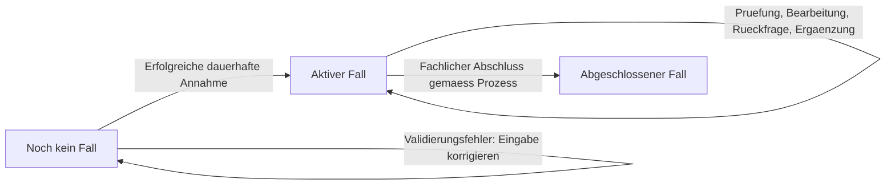

# Fallverwaltung – Fallanlage und Lebenszyklus

**Status:** Zentrale Spezifikation der bestehenden fachlichen Regeln; Statusverfeinerung und technische Verträge im Review.

**Stand:** 09.10.2026

**Geltungsbereich:** Erfassung, Backoffice, fachliche Services, Persistenz und Camunda-Integration von PropertyFlow.

## Zweck und Abgrenzung

Dieses Dokument definiert, wann ein Fall entsteht, wie er identifiziert und fortgeführt wird und was sein fachlicher Abschluss bedeutet. Es ist die gemeinsame Quelle für diese Regeln. Screen-Spezifikationen beschreiben ihre Darstellung; Use-Cases beschreiben die Nutzung aus Sicht der jeweiligen Akteure.

Die Anforderungen werden aus [Vision](../vision.md), [Projekt-Kontext](../project-context.md), [ADR-001](../architecture/adr/ADR-001-grundarchitektur.md), [ADR-002](../architecture/adr/ADR-002-camunda8-workflow-orchestrierung.md), den bestehenden Use-Cases und der bisherigen [Screen-01-Spezifikation](../frontend/ansicht-01-mieter-fallansicht.md) zusammengeführt. Akzeptierte Architekturentscheidungen bleiben gültig. Neue Konkretisierungen sind ausdrücklich als Review-Vorschlag gekennzeichnet.

| Zentrale Quelle | Verantwortung |
|---|---|
| Dieses Dokument | Fallidentität, Annahme, Ursprungsdaten, Zuordnung, fachlicher Lebenszyklus und Beziehung zum Workflow |
| [Fallkommunikation](fallkommunikation.md) | Interne/externe Nachrichten, Veröffentlichung, Ausschluss interner Memos aus LLM-Kommunikation und Nachrichtensperre nach Abschluss |
| [Fallzugriff und Sicherheit](fallzugriff-und-sicherheit.md) | Direkter persönlicher Tokenzugriff, Berechtigungen, Widerruf und Ersatz |
| [Benachrichtigungen und Zustellung](benachrichtigungen-und-zustellung.md) | E-Mail-Auslöser, Versandpflicht, Wiederholungen und Zustellfehler |
| [Screen 01](../frontend/ansicht-01-mieter-fallansicht.md) | Felddarstellung, Navigation, Routenübersicht, Rückmeldungen und Wireframes |
| [Architektur und Modulgrenzen](../architecture/module-structure.md) | Technische Zuständigkeiten und öffentliche Integrationsverträge |

Die konkrete zuverlässige Übergabe an Camunda und Mail, ein mögliches Outbox-Verfahren und konkrete Datenbankschemata werden separat entschieden. Dieses Dokument legt die erforderlichen fachlichen Ergebnisse fest und bestätigt keine bereits vorhandene Umsetzung.

## FALL-01: Fallidentität und Erfassungskanal

Ein Fall ist das dauerhaft angenommene Mieteranliegen mit seiner fachlichen Identität und dem zugehörigen Bearbeitungsverlauf. Das Öffnen eines Formulars und noch nicht übermittelte Eingaben erzeugen keinen Fall. Eine dauerhafte Entwurfsverwaltung ist im aktuellen Umfang nicht vorgesehen.

Die Case-ID wird serverseitig vergeben, ist eindeutig und bleibt über den Lebenszyklus unverändert. Ein Beispiel wie `REQ-2026-001` legt noch kein verbindliches Nummernformat fest. Die Case-ID ist weder ein Zugriffstoken noch die technische Camunda-Prozessinstanz-ID. Der persönliche Mieterlink enthält ausschliesslich einen geheimen Token; seine serverseitige Fallzuordnung und die unveränderte Case-ID bei Tokenersatz regelt [ZUG-01](fallzugriff-und-sicherheit.md#zug-01-case-id-und-geheimer-token).

Die [Vision](../vision.md) sieht Webformular und E-Mail als Eingangskanäle vor. Für jeden Kanal gelten dieselben Regeln zur dauerhaften Annahme und Fallidentität. Die Feldbelegung und sichere Zuordnung eingehender E-Mails sind separat zu spezifizieren. Eine E-Mail ist nicht automatisch ein neuer Fall; eine sicher zugeordnete Ergänzung gehört zum bestehenden Fall gemäss [KOM-03](fallkommunikation.md#kom-03-asynchrone-fallkommunikation).

Die Aktion «Neues Anliegen melden» eröffnet die Erfassung. Erst eine neue erfolgreich angenommene Einreichung erzeugt eine neue Case-ID. Das Ergänzen eines bestehenden Falls erzeugt keine neue Case-ID und keinen zweiten führenden Bearbeitungsprozess.

## FALL-02: Erfolgreiche Annahme

**Ein Fall gilt erst nach erfolgreicher dauerhafter Speicherung als angenommen.** Weder eine Browserbestätigung noch ein gestarteter LLM-Aufruf ersetzt diesen Zeitpunkt.

Für die Web-Erfassung sind Betreff, Beschreibung, Objekt-/Wohnungsreferenz und E-Mail-Adresse vorgesehen. Konkrete Feldlängen bleiben Review-Vorschläge der [Screen-Spezifikation](../frontend/ansicht-01-mieter-fallansicht.md#31-eingabefelder); deren Darstellung und Fehlertexte bleiben dort. Der Server prüft die geltenden Eingaberegeln unabhängig vom Browser.

Die Annahme umfasst fachlich:

1. Eingabe und zulässige Einreichung prüfen.
2. Case-ID vergeben und Ursprungsdaten dauerhaft speichern.
3. Die ursprüngliche Beschreibung als erste externe Mitteilung eindeutig in die Historie aufnehmen oder darauf referenzieren; keine fachlich doppelte Nachricht anlegen.
4. Den initialen fachlichen Stand als eingegangen und aktiv festhalten.
5. Die nachgelagerte Prozessübergabe und erforderliche Bestätigungsbenachrichtigung zuverlässig veranlassen.
6. Erst nach bestätigter Speicherung den Erfolg mit der Case-ID zurückmelden.

Die für eine angenommene Meldung erforderlichen Daten und Folgeaufträge müssen nach einem Neustart rekonstruierbar sein. Ihre technische Transaktionsgrenze wird im Integrationsdesign festgelegt; eine gemeinsame lokale Transaktion mit Camunda oder dem Maildienst wird nicht vorausgesetzt.

Die Erfassung wartet nicht auf KI/RAG, erfolgreiche E-Mail-Zustellung, einen erreichbaren Camunda-Server oder eine menschliche Entscheidung. Ein bereits gespeicherter Fall bleibt bei einem Ausfall dieser Komponenten erhalten und für die manuelle Bearbeitung zugänglich.

## FALL-03: Wiederholung und doppelte Einreichung

Die technische Wiederholung derselben Einreichung darf keinen zweiten Fall erzeugen. Der bereits beschriebene Absende-ID-Vertrag bleibt Grundlage: gleiche Einreichung und gleiche serverseitig geprüfte Absende-ID liefern dasselbe Ergebnis und dieselbe Case-ID zurück; abweichender Inhalt mit derselben Absende-ID wird als Konflikt behandelt. Der technische Vertrag und seine Aufbewahrungsdauer sind noch festzulegen.

Bei unklarem Request-Ausgang, etwa nach einem Netzwerkabbruch, kann die Speicherung bereits erfolgt sein. Eine Wiederholung darf deshalb keine neue fachliche Identität erzeugen. Auch Prozessstart-Wiederholungen müssen demselben Fall zugeordnet und gegen Mehrfachwirkung abgesichert werden.

Das ist von zwei bewusst getrennten Einreichungen mit ähnlichem Inhalt zu unterscheiden: Eine automatische fachliche Zusammenführung solcher Fälle ist nicht beschlossen. Ähnliche Texte allein rechtfertigen weder Zusammenführen noch Verwerfen eines Anliegens.

## FALL-04: Ursprungsdaten und Zuordnung

Die bei der Annahme gespeicherten Ursprungsangaben sind für den Mieter unveränderlich. Er ergänzt oder korrigiert seine Meldung über eine neue Nachricht. Die Ursprungseingabe und frühere Nachrichten werden dadurch nicht überschrieben.

Die eingegebene Objekt-/Wohnungsreferenz ist von einer später bestätigten Zuordnung zu Mieterstammdaten zu unterscheiden. Eine unklare Zuordnung verhindert die Annahme nicht. Sie bleibt intern als offen erkennbar und kann durch die dafür zuständige Fachbearbeitung geklärt werden. Dabei dürfen keine fremden Stammdaten in der öffentlichen Erfassung offengelegt werden.

Eine syntaktisch gültige E-Mail und eine angegebene Adresse bestätigen weder die persönliche Identität noch das Mietverhältnis. Identitätsprüfung, Empfängerwechsel und Zugriffsberechtigungen werden in [Fallzugriff und Sicherheit](fallzugriff-und-sicherheit.md) geführt. Ein Ablauf oder Widerruf des Falllinks verändert den fachlichen Fallstatus nicht.

**Review-Vorschlag zur Nachvollziehbarkeit:** Bestätigte oder korrigierte Zuordnungen werden getrennt von den ursprünglichen Freitextangaben geführt. Berechtigung und Protokollierung solcher Backoffice-Änderungen sind im Servicevertrag zu konkretisieren.

## FALL-05: Fachlicher Lebenszyklus

Der gemeinsame Grundzustand unterscheidet **noch keinen Fall**, **aktiven Fall** und **abgeschlossenen Fall**. «Neuer Fall» bezeichnet im UI das Erfassungsformular und ist kein bereits persistierter Fallstatus.

| Phase | Eintritt | Bedeutung und zulässige Fortsetzung |
|---|---|---|
| Noch kein Fall | Formular geöffnet oder Annahme gescheitert | Eingaben können korrigiert und eingereicht werden. Kein bearbeitbarer Fall wurde bestätigt. |
| Aktiv | Annahme nach FALL-02 erfolgreich | Der Fall existiert, auch wenn der Prozessstart noch aussteht. Zuordnung, Prüfung, Bearbeitung und Kommunikation erfolgen unter den jeweiligen Berechtigungen. |
| Abgeschlossen | Fachlich vorgesehener Abschluss nach FALL-07 konsistent übernommen | Berechtigtes Lesen bleibt möglich; die Nachrichtensperre aus KOM-04 gilt. Eine neue Meldung ist ein separater Fall. |

Das Diagramm zeigt den fachlichen Grundvertrag. Es ersetzt weder BPMN noch schreibt es eine zweite Workflow-Engine in PropertyFlow vor.

### Bearbeitungsstand innerhalb eines aktiven Falls – Review-Vorschlag

Die folgende Verfeinerung beschreibt mögliche fachliche Bedeutungen. Verbindliche Enum-Werte, Übergänge und UI-Texte werden erst mit dem BPMN-/Fachmodell abgestimmt.

| Vorgeschlagener Bearbeitungsstand | Bedeutung |
|---|---|
| Eingegangen | Dauerhaft angenommen; weitere Bearbeitung kann noch ausstehen. |
| In Bearbeitung | Fachliche Abklärung oder Bearbeitung läuft; UI-Beispiel bisher auch «In Abklärung». |
| Rückmeldung benötigt | Eine tatsächlich veröffentlichte Rückfrage wartet auf Informationen des Mieters. |
| Bei der Immobilienverwaltung | Eine menschliche Prüfung oder Bearbeitung steht an; UI-Beispiel bisher «Beim Backoffice». |

Alle diese Bearbeitungsstände gehören zur aktiven Phase. Eine zusätzliche Nachricht ist während eines aktiven Falls zulässig, auch wenn der Workflow gerade nicht auf eine Mieterantwort wartet. Welche Fortsetzung sie auslöst, bestimmt der modellierte Prozess. Der blosse Eingang einer Nachricht beantwortet nicht automatisch jede offene fachliche Rückfrage.

Die Zuordnung ist keine feste lineare Reihenfolge. Der Workflow kann Abklärungen und Rückfragen wiederholen. Solche Schleifen behalten die Case-ID bei und öffnen keine neue Fallanlage.

## FALL-06: Fachlicher Status und technischer Workflow

| Information | Führende Verantwortung | Abgrenzung |
|---|---|---|
| Case-ID, Ursprungsdaten, Objektzuordnung, fachlicher Status und Verlauf | PropertyFlow | Grundlage der fachlichen Fallansichten |
| Prozessinstanz, Prozessposition, aktive Aufgaben, Timer, Jobs und Incidents | Camunda 8 | Technischer Workflow-State gemäss ADR-002 |
| E-Mail-Auftrag und Versand-/Zustellinformation | PropertyFlow und Mailintegration | Benachrichtigungszustand; kein Fallstatus |
| Analyseergebnis oder technischer Analysefehler | Zuständiger PropertyFlow-Service | Unterstützende Information; keine eigenständige fachliche Abschlussentscheidung |

Für einen angenommenen Fall wird genau ein führender Camunda-Bearbeitungsprozess zuverlässig gestartet und dem Fall zugeordnet. Unmittelbar nach Annahme kann dieser Start noch ausstehen. Ein technischer Retry darf keine zweite unabhängige Bearbeitung desselben Falls eröffnen. Eine mögliche interne BPMN-Zerlegung wird dadurch nicht vorweggenommen.

Fachliche Statusänderungen erfolgen durch autorisierte PropertyFlow-Anwendungsdienste im vorgesehenen Prozessablauf. Der Browser kann Statuswerte nicht verbindlich vorgeben. PropertyFlow speichert den fachlichen Status als fachliche Sicht auf den Ablauf; es führt daneben keinen konkurrierenden Workflow ein.

Technische Incidents, Wiederholungen, ein nicht erreichbarer LLM-Dienst oder ein fehlgeschlagener E-Mail-Versand schliessen den Fall nicht. Der letzte bestätigte fachliche Status bleibt massgeblich. Die Verwaltung muss den Fall trotz ausgefallener Automatisierung manuell weiterbearbeiten können; die technische Synchronisierung ist im Integrationsvertrag abzusichern.

Ein technischer Abbruch oder ein beliebiges BPMN-Endereignis ist nicht ohne fachliche Zuordnung mit einem erfolgreichen Fallabschluss gleichzusetzen. Massgeblich ist der im Fachprozess ausdrücklich vorgesehene Abschluss.

## FALL-07: Abschluss und Zeit danach

Ein Fall wechselt erst nach dem fachlich vorgesehenen Abschluss im Camunda-Ablauf und der konsistenten Übernahme in PropertyFlow in die abgeschlossene Phase. Eine abgeschlossene KI-Analyse, ein Browserabbruch oder eine verschickte E-Mail genügt dafür nicht.

Wer den Abschluss auslösen darf, welche Nachweise erforderlich sind und ob eng begrenzte automatische Abschlussregeln zulässig sind, muss im Fach-/BPMN-Modell ausdrücklich festgelegt werden. Eine allgemeine autonome Abschlussberechtigung des LLM ist nicht beschlossen. Bestehende menschliche Prüf- und Freigabegrenzen aus [ADR-002](../architecture/adr/ADR-002-camunda8-workflow-orchestrierung.md) und der [Sicherheitsbasis](../evaluation/evaluationsgrundlage.md) bleiben verbindlich.

Die Folgen für interne und externe Nachrichten sind zentral in [KOM-04](fallkommunikation.md#kom-04-nachrichtensperre-nach-fallabschluss) festgelegt: Nach Abschluss dürfen keine neuen Nachrichten mehr entstehen. Die dort verlangte Synchronisierung muss gleichzeitig mit dem Abschluss greifen, auch bei konkurrierenden Requests und verspäteten Worker-Ergebnissen.

**Zu konkretisierende Abschlussreihenfolge:** Falls eine Abschlussmitteilung vorgesehen ist, muss sie vor Eintritt der Schreibsperre oder als fachlich konsistenter Teil des Abschlusses gespeichert werden. Ein nachträglicher Worker darf die Sperre nicht für eine neue Nachricht umgehen. Der Versand einer bereits gespeicherten externen Mitteilung ist davon als separater Folgeauftrag zu unterscheiden.

Der abgeschlossene Fall bleibt mit gültiger Berechtigung lesbar. Screen 01 bietet keine Wiedereröffnung. Ein erneutes Anliegen wird separat angelegt. Eine globale Wiedereröffnungs-, Zusammenführungs- oder Stornierungsfunktion ist noch nicht spezifiziert und wird durch dieses Dokument nicht eingeführt.

Abschluss ist weder Löschung noch Ablauf einer Zugriffsberechtigung. Archivierung, Aufbewahrung und besondere Löschprozesse benötigen eigene Festlegungen.

## FALL-08: Nachvollziehbarkeit

Case-ID, Eingangszeitpunkt und die gespeicherten Ursprungsdaten müssen die ursprüngliche Annahme eindeutig erkennbar machen. Die Nachrichtenhistorie folgt [KOM-01](fallkommunikation.md#kom-01-interne-und-externe-nachrichten); interne Änderungen werden dadurch nicht automatisch mieteröffentlich.

**Review-Vorschlag für den Statusverlauf:** Für einen fachlichen Statuswechsel werden vorheriger und neuer Status, Serverzeitpunkt, auslösender Akteur bzw. Prozessschritt und eine geeignete Referenz nachvollziehbar festgehalten. Fachliche Änderungen durch Wiederholungen dürfen nicht mehrfach wirksam werden. Datenminimierung und die bestehenden Auditregeln gelten weiterhin.

Zeitpunkte werden in UTC gespeichert; ihre Darstellung ist Sache der jeweiligen Oberfläche. Interne Aktualisierungen und der Zeitpunkt der letzten mieteröffentlichen Änderung bleiben unterscheidbar.

## FALL-09: Fehler und Grenzfälle

| Ereignis | Fachliches Ergebnis |
|---|---|
| Ungültige Eingabe | Keine erfolgreiche Annahme; Eingabe korrigieren. |
| Fehler vor bestätigtem Commit | Kein Erfolg bestätigen; keine unbestätigte Fallanlage als angenommen darstellen. |
| Antwort geht nach Commit verloren | Fall kann bereits existieren; Wiederholung muss sein vorhandenes Ergebnis liefern. |
| Camunda vorübergehend nicht erreichbar | Angenommener Fall bleibt aktiv; Prozessstart wird zuverlässig nachgeholt. |
| KI/RAG oder Stammdatenabfrage fällt aus | Fall bleibt gespeichert; fehlende Analyse oder Zuordnung wird intern behandelt, manuelle Bearbeitung bleibt möglich. |
| Bestätigungs-E-Mail wird nicht zugestellt | Fall und Case-ID bleiben bestehen; Versandproblem separat behandeln. |
| Zusätzliche Nachricht bei aktivem Fall | Bestehenden Fall ergänzen; keinen neuen Fall und keinen zweiten führenden Prozess anlegen. |
| Nachricht trifft während oder nach Abschluss ein | Konsistente Durchsetzung der Nachrichtensperre gemäss KOM-04. |
| Falllink abgelaufen oder widerrufen | Zugriff entfällt; fachlicher Fallstatus ändert sich dadurch nicht. |
| Ähnliche neue Meldung | Keine automatische Zusammenführung ohne gesondert festgelegte Regel. |

## Prüfkriterien

Diese Kriterien dienen der späteren Umsetzung und sind keine bereits ausgeführten Testnachweise. Die Prüfung fachlicher Services muss gemäss Projekt-Kontext ohne reale externe Systeme möglich sein.

### FALL-AK-01

Das Öffnen der Erfassung und eine abgewiesene Eingabe erzeugen keinen angenommenen Fall. Erst nach dauerhaftem Speichern wird die Case-ID mit Erfolg zurückgegeben; Ursprungsmeldung und fachlicher Eingang sind eindeutig nachvollziehbar.

### FALL-AK-02

Wiederholung derselben angenommenen Einreichung liefert dieselbe Case-ID. Doppelklick und verlorene HTTP-Antwort erzeugen weder einen zweiten Fall noch eine zweite Ursprungsnachricht. Abweichender Inhalt mit derselben Absende-ID wird als Konflikt behandelt.

### FALL-AK-03

Ein Ausfall von Camunda, Mail oder KI nach Annahme verliert den Fall nicht. Der Prozessstart kann ausstehen und wird wiederholt, ohne eine zweite unabhängige Bearbeitung zu erzeugen; manuelle Bearbeitung bleibt zugänglich.

### FALL-AK-04

Eine unklare Objektzuordnung verhindert die Annahme nicht. Ursprüngliche Freitextangaben bleiben bei späterer Zuordnung nachvollziehbar. Eine syntaktisch gültige Kontaktadresse wird nicht als bestätigtes Mietverhältnis behandelt.

### FALL-AK-05

Eine Ergänzung zu einem aktiven Fall behält Case-ID und Ursprungsdaten bei. Sie legt keinen neuen Fall an und startet keinen zweiten führenden Bearbeitungsprozess. Der aktuelle BPMN-Schritt bestimmt die weitere Verarbeitung.

### FALL-AK-06

Technische Retries, Incidents, KI-Ergebnisse und Mailzustände bewirken für sich allein keinen fachlichen Abschluss. Eine abgelaufene Zugriffsberechtigung ändert den Fallstatus ebenfalls nicht.

### FALL-AK-07

Der fachlich vorgesehene Abschluss wird in PropertyFlow konsistent übernommen. Die Nachrichtensperre wird nach [KOM-AK-07](fallkommunikation.md#kom-ak-07) auch bei gleichzeitigen Schreibversuchen geprüft. Eine gegebenenfalls gespeicherte Abschlussmitteilung umgeht diese Sperre nicht.

### FALL-AK-08

Mieteransicht und Backoffice lesen den fachlichen Status aus derselben PropertyFlow-Grundlage.
Ein vom Browser eingesandter Statuswert kann den Fall nicht eigenmächtig schliessen oder wiedereröffnen.

### FALL-AK-09

Ein abgeschlossener Fall bleibt bei gültiger Berechtigung lesbar. 
Eine neue erfolgreiche Einreichung erzeugt einen separaten Fall; 
Screen 01 öffnet den alten Fall dabei nicht wieder.

## Offene Entscheidungen und Weiterentwicklung

- Konkrete Case-ID-Darstellung und Beziehung zur technischen Prozessreferenz.
- Verbindliche Bearbeitungsstände, Übergangsbedingungen und ihr Mapping zum BPMN-Modell; die Tabelle unter FALL-05 ist ein Review-Vorschlag.
- Abschlussberechtigungen, fachliche Abschlusskriterien und gegebenenfalls Reihenfolge der Abschlussmitteilung.
- Technische Koordination von Annahme, Prozessstart, Statusübernahme und Nachrichtensperre; Absende-ID-/Retry-Verträge und ihre Aufbewahrungsdauer.
- Nachvollziehbarkeit und Berechtigungen bei Backoffice-Korrekturen und Stammdatenzuordnungen.
- E-Mail-Eingangsvertrag sowie spätere Regelungen für Archivierung, Löschung, mögliche Wiedereröffnung oder Zusammenführung.

Änderungen an diesen fachlichen Regeln werden hier gepflegt. Kommunikationsregeln bleiben in `fallkommunikation.md`, Darstellung und Bedienung in den Screen-Spezifikationen. Bei Umsetzung eines bislang offenen Punktes werden die betroffenen Use-Cases und gegebenenfalls Architekturentscheidungen gezielt fortgeschrieben.
